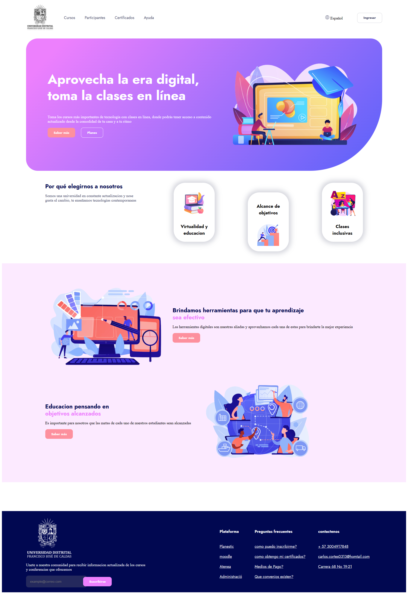
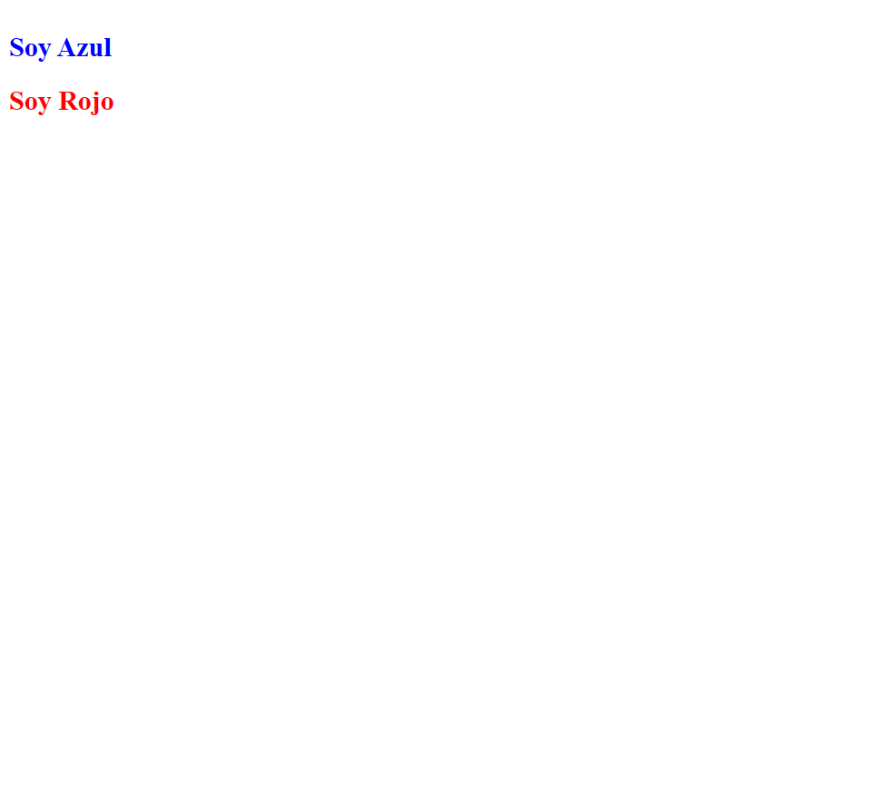
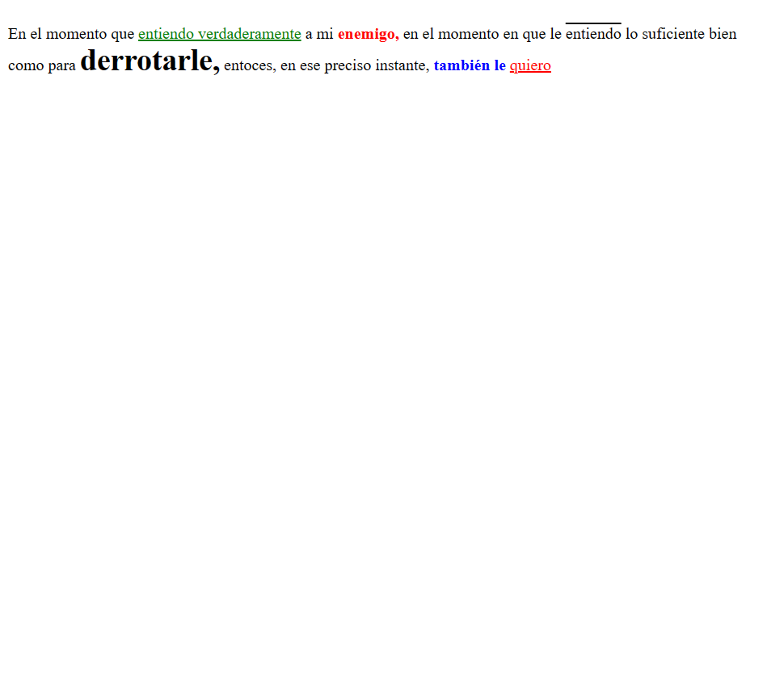
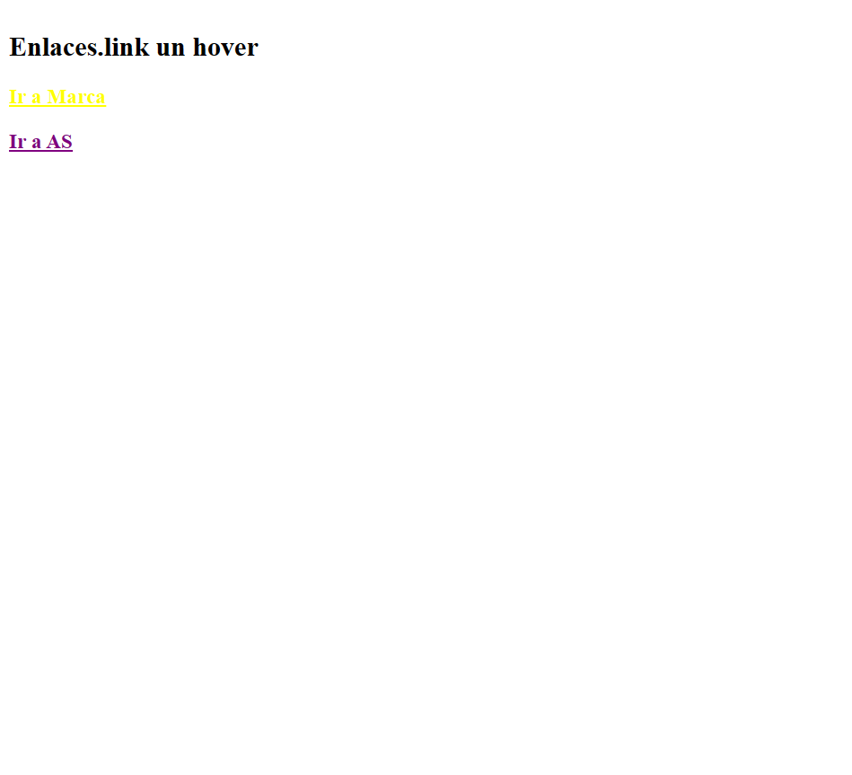

<h1>Taller 9 - Carlos Alberto Cortes Leonel </h1>

<h2>Información</h2>

 Curso: Full Stack Básico - Grupo 1

Profesor: Cristian Patiño

 <h2>Link de la pagina web</h2>
    <a href="https://carloscortesl.github.io/taller-full-stack"> link de pagina web</a>

 <h2>Punto 1: Link de figma</h2>
 <a href="https://www.figma.com/file/D3O7oxBfUvMaxVtzER1Pv6/Carlos-Alberto-Cortes-Leonel?type=design&node-id=7%3A256&mode=design&t=5k55zsjh7b4HIz1i-1"> link de Figma</a>
 
 <h2>Punto 2: Diseño en HTML</h2>
 

 <h2>Punto 3: Diseño con CSS</h2>
 

 <h2>Punto 4: Titulos</h2>
 

 <h2>Punto 5: Párrafos</h2>
 

 <h2>Punto 6: Links</h2>
 

 <h2>Punto 7 y 8: Navegación</h2>
 

 <h2>Punto 9: Tabla</h2>